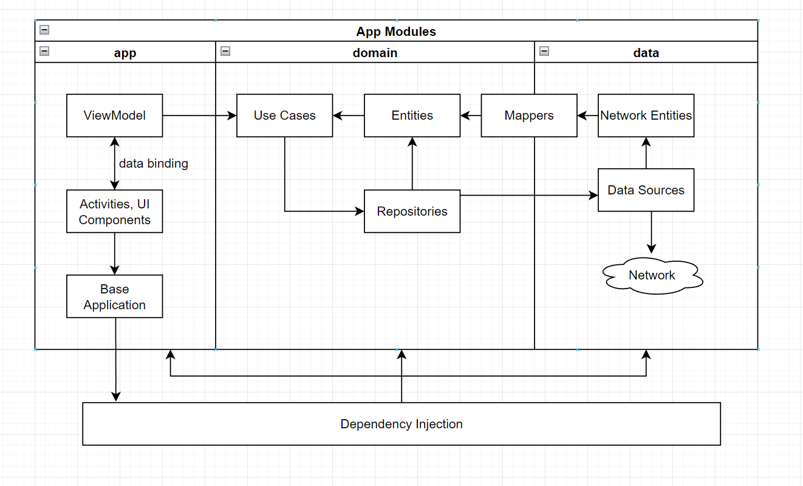
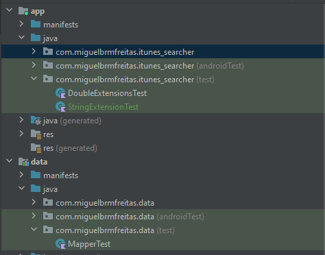

# iTunes Searcher
Android app to search for artists, albums or tracks and get a list of related songs using the [iTunes Searcher API](https://developer.apple.com/library/archive/documentation/AudioVideo/Conceptual/iTuneSearchAPI/Searching.html#//apple_ref/doc/uid/TP40017632-CH5-SW1). Each song may be clicked for further details.


<video src="https://user-images.githubusercontent.com/6539610/196914924-6cbdc0c1-9a8b-4709-b254-d998d4a35ff5.mp4"> </video>


## Technical Design
The high level app architecture looks like this. It's inspired by [Uncle Bob's Clean Architecture](https://blog.cleancoder.com/uncle-bob/2012/08/13/the-clean-architecture.html) + [MVVM](https://developer.android.com/topic/architecture), although not totally by the book. Each layer is an separate module on the project so the app can grow easily while keeping separation of concerns, reusability and quality of code. The domain is the inner module and accessed by app and data modules. The app module works as the presentation layer and sees the domain and data modules. The app module is the application entrypoint and set the Dependency Injection.




[Check this link to see the full design.](https://drive.google.com/file/d/1qRgH6Jz-X8WToYr7I5vm8GwoBeCpAKiS/view?usp=sharing)

## Domain Module


The domain module is a pure kotlin module with the abstractation of business logic. It has no Android-related dependency. It's the inner module in clean architecture and is seen by app and data modules, but does see them.

- UseCases: makes the necessary calls from the repositories and get it ready to the UI. GetResultsUseCase calls the necessary method from the ItunesSearcherRepository and may add aditional logic.
- Entities: basically the app models. The domain Entity is read to be used at the app/presentation layer, but it's mapped from the network entity in data module first
- Repositories: interface to get the data from the data module. ItunesSearcherRepository does the job.
- CustomResponse: API responses wrapper (Success or Failure)
- Extensions: takes advantaged from Kotlin extensions features to write custom functions to existing classes. At domain we have useful extensions for String and Double to be used app-wide, supporting the business logic.

## Data Module


The data module is responsible for all data sources that the app relies on, that could be either local or remote. For now the first and only data source is the [iTunes Searcher API](https://developer.apple.com/library/archive/documentation/AudioVideo/Conceptual/iTuneSearchAPI/Searching.html#//apple_ref/doc/uid/TP40017632-CH5-SW1).

- ITunesSearcherRepositoryImpl: the data module makes the actual implementation of the Repository interface. From there the API services are called.
- ItunesSearcherService: service with the contract to fetch data from the API.
- Responses: network entities to map the JSON objects from the API using Moshi. It comes raw from the API, just with few property name changes.
- Mappers: functions to map a network entity to a domain entity (that's better suited to be used in the app)
- NetworkModule: define the Dependency Injection for network and repository calls.


## App Module


The app module is the starting point to the app and works as the presentation layer to handle all UI logic and design. To do so, a MVVM approach is used. The app module also takes care of the Dependency Injection for all layers through the MainApplication class. It takes advantage from modern Android Jetpack libraries, Kotlin features and SOLID concepts to deliver clean and efficient code.

Each feature may have several packages under it, with activity, viewmodel. fragments, adapters, listeners and so on.

- Activities: each Activity is an app screen to interact with the user and runs along with the app lifecycle. DataBinding is used to populate views with data from ViewModel with reactive programming + MutableStateFlow. The Activity is a dumb view with its state controlled by ViewModel. MainActivity is the only Activity so far, but it could easily grow.
- Fragments: each Fragment is an encapsulated component attached to an Activity, a smaller part of the view. Also uses DataBinding to observe data from ViewModel. Now we have TrackDetailsBottomSheetFragment to show the details of a clicked song.
- ViewModel: a ViewModel class is responsible for all the view logic and data, handling and managing all UI-related data. The ViewModel is aware of the view's lifecycle. It calls the UseCases from domain layer and handle all the data flow to be observed by the views with the help of Coroutines. MainViewModel is the main only viewmodel so far and calls GetResultsUseCase. It has a holder class MainViewModelState.
- Adapters: implementation of RecyclerView.Adapter and manages all the logic to deal with RecyclerView lists. It has rules to bind each element of an array (with DataBinding) at every position. There's an adittional ViewHolder class for each adapter with rules to bind an individual item.
- MainApplication: the start of everything. Deals with app-wide state and injects the dependency with Koin from AppModule and NetworkModule
- Base classes: abstract classes to be reused by activities and viewmodels (additional base classes may be implemented later)
- Extensions: takes advantaged from Kotlin extensions features to write custom functions to existing classes. At app module we have extensions that are meant for presentation layer.
- Components: data classes to set everything up for UI components. So far we have RecyclerComponent to create RecyclerView with a given adapter and other configurations.

## Tests

Some unit tests were written to check some functionalities, like mappers (network entity to domain entity) and extension functions. Additional tests will be implemented to cover ViewModel, Repository and UseCase.




## Stack
- Coded in [Kotlin](https://kotlinlang.org)
- UI and Android-related libraries from [Android Jetpack](https://developer.android.com/jetpack)
- Network calls with [Retrofit](https://github.com/square/retrofit)
- JSON parsing with [Moshi](https://github.com/square/moshi)
- Concurrency with [Coroutines & Flows](https://kotlin.github.io/kotlinx.coroutines/)
- Dependency Injection with [Koin](https://insert-koin.io/)
- Async image loading with [Coil](https://coil-kt.github.io/coil/) 

## Next steps
- [ ] Create reusable themes and styles for the app layouts

- [ ] Make the app looks better improving UI/UX

- [ ] Create a embedded player to play the 30-second song from previewUrl property  

- [ ] Map API errors 

- [ ] Enhance unit tests coverage

## 📃 License

```
MIT License

Copyright (c) 2022 Miguel Freitas

Permission is hereby granted, free of charge, to any person obtaining a copy
of this software and associated documentation files (the "Software"), to deal
in the Software without restriction, including without limitation the rights
to use, copy, modify, merge, publish, distribute, sublicense, and/or sell
copies of the Software, and to permit persons to whom the Software is
furnished to do so, subject to the following conditions:

The above copyright notice and this permission notice shall be included in all
copies or substantial portions of the Software.

THE SOFTWARE IS PROVIDED "AS IS", WITHOUT WARRANTY OF ANY KIND, EXPRESS OR
IMPLIED, INCLUDING BUT NOT LIMITED TO THE WARRANTIES OF MERCHANTABILITY,
FITNESS FOR A PARTICULAR PURPOSE AND NONINFRINGEMENT. IN NO EVENT SHALL THE
AUTHORS OR COPYRIGHT HOLDERS BE LIABLE FOR ANY CLAIM, DAMAGES OR OTHER
LIABILITY, WHETHER IN AN ACTION OF CONTRACT, TORT OR OTHERWISE, ARISING FROM,
OUT OF OR IN CONNECTION WITH THE SOFTWARE OR THE USE OR OTHER DEALINGS IN THE
SOFTWARE.
```
